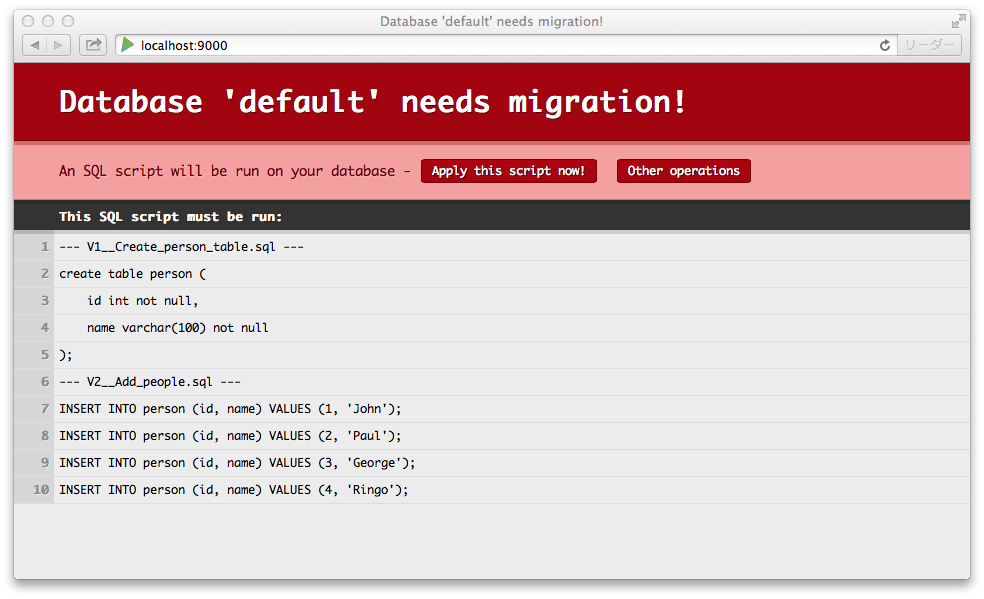
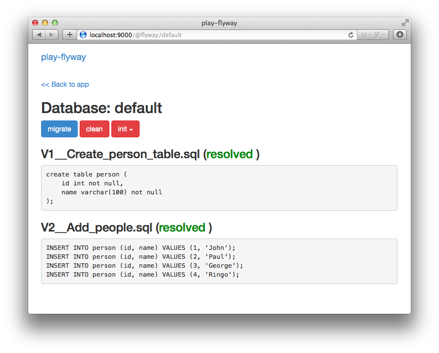

# flyway-play

[](https://travis-ci.org/flyway/flyway-play)

Flyway module for Play 2.4 or later. It aims to be a substitute for play-evolutions.

This module is successor of [tototoshi/play-flyway](https://github.com/tototoshi/play-flyway), which is a Play Plugin supporting Play 2.1 ~ 2.3.

## <a class="anchor" name="features"></a>Features

 - Based on [Flyway](http://flywaydb.org/)
 - No 'Downs' part.
 - Independent of DBPlugin(play.api.db).

## <a class="anchor" name="install"></a>Install

build.sbt

```scala
libraryDependencies ++= Seq(
  "org.flywaydb" %% "flyway-play" % "3.0.0"
)
```

conf/application.conf

```
play.modules.enabled += "org.flywaydb.play.PlayModule"
```


## <a class="anchor" name="getting-started"></a>Getting Started

### Basic configuration

Database settings can be set in manner of Play2.

```
db.default.driver=org.h2.Driver
db.default.url="jdbc:h2:mem:example2;db_CLOSE_DELAY=-1"
db.default.username="sa"
db.default.password="secret"

# optional
db.default.schemas=["public", "other"]
```

### Place migration scripts

A migration script is just a simple SQL file.

```sql
CREATE TABLE FOO (.............


```

By default place your migration scripts in `conf/db/migration/${dbName}` .

```
playapp
├── app
│   ├── controllers
│   ├── models
│   └── views
├── conf
│   ├── application.conf
│   ├── db
│   │   └── migration
│   │       ├── default
│   │       │   ├── V1__Create_person_table.sql
│   │       │   └── V2__Add_people.sql
│   │       └── secondary
│   │           ├── V1__create_job_table.sql
│   │           └── V2__Add_job.sql
│   ├── play.plugins
│   └── routes
```

Alternatively, specify one or more locations per database and place your migrations in `conf/db/migration/${dbName}/${locations[1...N]}` .  By varying the locations in each environment you are able to specify different scripts per RDBMS for each upgrade.  These differences should be kept minimal.

For example, in testing use the configuration:

```
db.default.migration.locations=["common","h2"]
```

And in production use the configuration:

```
db.default.migration.locations=["common","mysql"]
```

Then put your migrations in these folders. Note that the migrations for the `secondary` database remain in the default location.

```
playapp
├── app
│   ├── controllers
│   ├── models
│   └── views
├── conf
│   ├── application.conf
│   ├── db
│   │   └── migration
│   │       ├── default
│   │       │   ├── common
│   │       │   │   └── V2__Add_people.sql
│   │       │   ├── h2
│   │       │   │   └── V1__Create_person_table.sql
│   │       │   ├── mysql
│   │       │   │   └── V1__Create_person_table.sql
│   │       └── secondary
│   │           ├── V1__create_job_table.sql
│   │           └── V2__Add_job.sql
│   ├── play.plugins
│   └── routes
```


Please see flyway's documents about the naming convention for migration scripts.

http://flywaydb.org/documentation/migration/sql.html

### Placeholders

Flyway can replace placeholders in Sql migrations.
The default pattern is ${placeholder}.
This can be configured using the placeholderPrefix and placeholderSuffix properties.

The placeholder prefix, suffix and key-value pairs can be specificed in application.conf, e.g.

```
db.default.migration.placeholderPrefix="$flyway{{{"
db.default.migration.placeholderSuffix="}}}"
db.default.migration.placeholders.foo="bar"
db.default.migration.placeholders.hoge="pupi"
```

This would cause

```sql
INSERT INTO USERS ($flyway{{{foo}}}) VALUES ('$flyway{{{hoge}}}')
```

to be rewritten to

```sql
INSERT INTO USERS (bar) VALUES ('pupi')
```

### Enable/disable Validation

From flyway 3.0, `validate` run before `migrate` by default.
Set `validateOnMigrate` to false if you want to disable this.

```
db.${dbName}.migration.validateOnMigrate=false // true by default
```

### Migration prefix

Custom sql migration prefix key-value pair can be specified in application.conf:

```
db.${dbName}.migration.sqlMigrationPrefix="migration_"
```

### Insert Query

If you want to apply your migration not via the web interface, but manually on
your production databases you also need the valid insert query for flyway.

```
db.${dbName}.migration.showInsertQuery=true
```

### Dev




For existing schema, Flyway has a option called 'initOnMigrate'. This option is enabled when `-Ddb.${dbName}.migration.initOnMigrate=true`.
For example,
```
$ play -Ddb.default.migration.initOnMigrate=true
```

Of course, You can write this in your `application.conf`.


Manual migration is also supported. Click 'Other operations' or open `/@flyway/${dbName}` directly.




### Test

In Test mode, migration is done automatically.


### Prod

In production mode, migration is done automatically if `db.${dbName}.migration.auto` is set to be true in application.conf.
Otherwise it failed to start when migration is needed.

```
$ play -Ddb.default.migration.auto=true start
```

## <a class="anchor" name="example"></a>Example application

[seratch/devteam-app](https://github.com/seratch/devteam-app "seratch/devteam-app") is using play-flyway. Maybe this is a good example.

## compile-time DI support


```scala
class MyComponents(context: Context) extends BuiltInComponents(context) with FlywayPlayComponents {
  flywayPlayInitializer
  ...
}
```

## <a class="anchor" name="changelog"></a>Change Log

### 3.0.0

 - Support Play 2.5
 - Support compile-time DI
 - Refactored view code with twirl
 - Ignore non-flyway db.* entry in application.conf

### 2.3.0

 - Flyway 4.0

### 2.2.1

 - Add support for Flyway sqlMigrationPrefix parameter.
 - Flyway 3.2.1

### 2.2.0

 - Removed dependency on play.api.Application

### 2.1.0

 - Support for specifying a list of schemas
 - Fixed classloader issue

### 2.0.1

 - Supported new configuration key, `db.default.username`.

### 2.0.0

 - Play 2.4 support

## <a class="anchor" name="license"></a>License

- Apache 2.0 License
